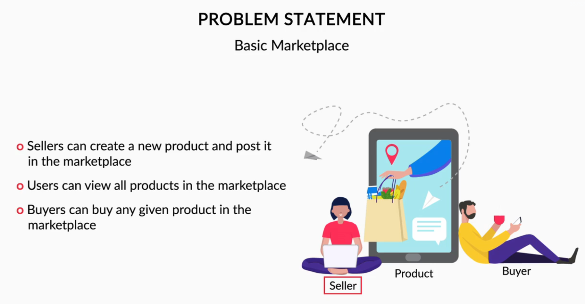

*   Problem Statement  
     We will look at the problem statement that we will be using to build a decentralized application, or DApp.

     The decentralized application that we will be building in this example, represents a basic marketplace.
     The application allows a user to create products. They can list these products on the marketplace and 
     then all of the other users can view all of these products and they can choose to buy them. 

     The workflow for this application starts with a seller posting the new item to be sold. Then all of the 
     other users can view the Item and if a buyer wants to purchase one of these Items, they can claim the 
     Item by changing the Item status from available to sold and then the ownership of the Item will be
     transferred. This workflow will demonstrate how you can interact with the Ethereum blockchain through
     a web application. 
    
    
     

     As per the image, the application has three broader functionalities:  
        Register Product: Sellers can register their products on the platform.  
        Buy Product: Buyers can purchase available products.  
        View All Products: Each user can see all the products that are available in the marketplace.  